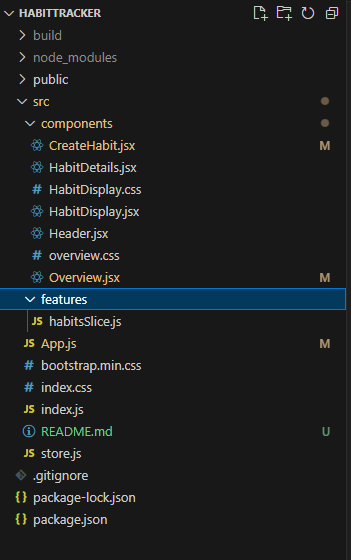

# Habit tracker using React app
A habit tracker app which can define and track them using react app.

## Features included
* #### Add habit ####
  Add habits to track like reading a book, going to the gym etc.

* #### Display Habits ####
  A list view to display all current habits.

* #### Track Habit ####
    Track the habit by changing the status. There are 3 status of a habit:
  * Done - Mark the habit as done for a day
  * Not done - Mark the habit as not done for a day
  * None - User did not take any action on a habit for a day

* #### Delete Habit ####
  * Delete any habit from the list

## Folder structure
    
  * src
    * components
      * CreateHabit : component that is displayed when the user wants to create a new habit(modal dialog)
      * HabitDetails: component that displays the habit details for a week that user have already added
      * HabitDisplay: component that displays all the current habits saved by the user
      * Header: component that displays header
      * Overview: component that displays the list of habit name and add new habit button
    * features
      * habitsSlice: component that contains Slice for habit that include the action and reducer to add, delete and change status
    * App: component which acts a container for all the other components
    * index: the entry point of the project

## Links
1. [Code link](https://github.com/Meghna24R/HabitTracker)
2. [Hosted link](https://meghna24r.github.io/HabitTracker/)